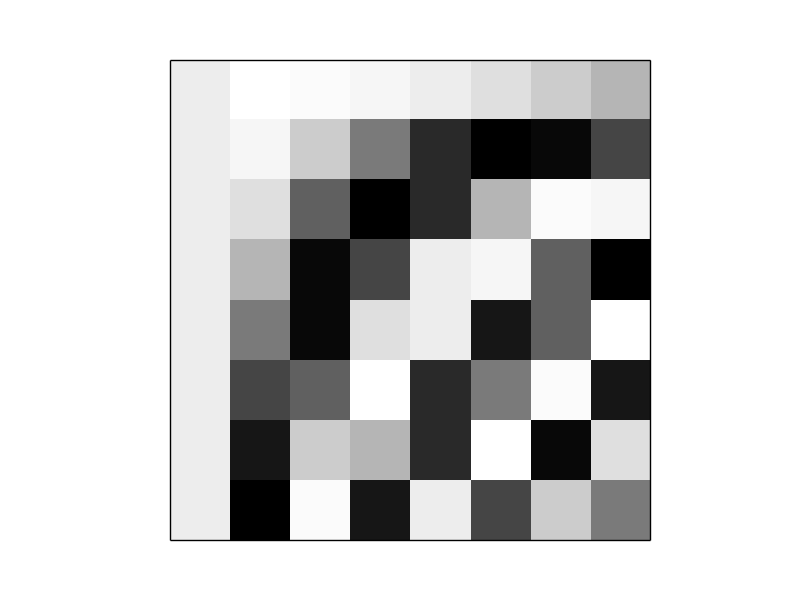
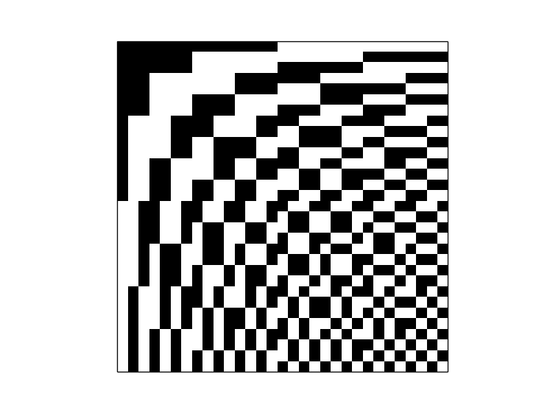

# M-matrices compression

Python scripts to investigate and explore the image & video compression algorithm based on M-matrices.

## Matrices
Butterworth filter matrix

DCT

Mersenne matrix of 31st order

